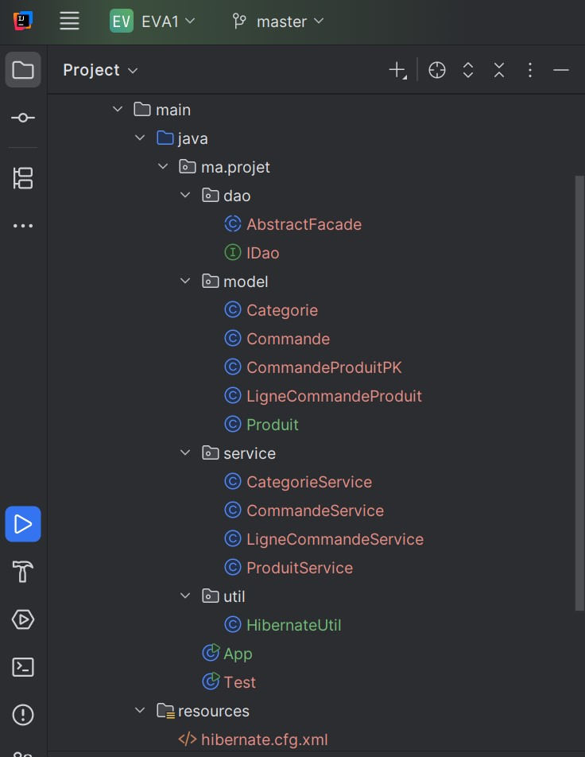
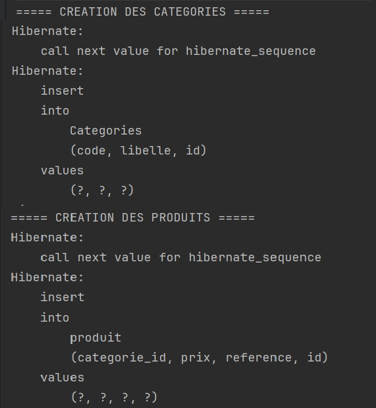
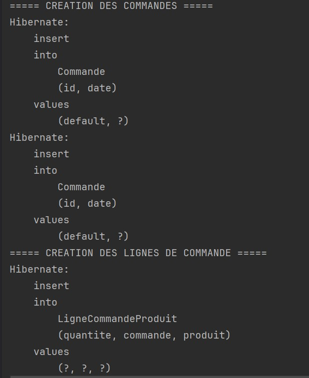
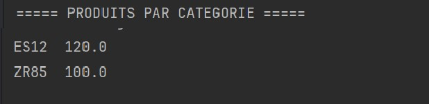
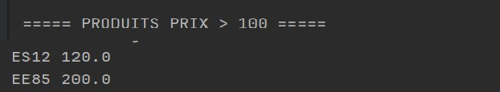

# Gestion des Produits et Commandes avec JPA / Hibernate

## Présentation

Ce projet présente la réalisation d’une application Java basée sur **JPA et Hibernate** permettant de gérer des **produits**, leurs **catégories**, ainsi que les **commandes** effectuées sur ces produits.  
L’objectif principal est de mettre en pratique les concepts de **programmation orientée objet**, de **mapping objet-relationnel (ORM)** et d’architecture en couches dans une application Java.

Le projet met en œuvre une organisation structurée du code, ainsi que l’implémentation de plusieurs requêtes permettant l’exploitation des données stockées dans la base.

## Architecture du projet

Le projet est organisé selon une architecture en plusieurs packages afin de séparer les responsabilités :

---
## Fonctionnalités implémentées

Le système permet de réaliser plusieurs opérations liées à la gestion des produits et des commandes.

### Gestion des catégories
- création et enregistrement des catégories
- association des produits à leurs catégories

### Gestion des produits
- création et enregistrement des produits
- association des produits à une catégorie
- consultation des produits selon différents critères

### Gestion des commandes
- création de commandes
- ajout de produits dans une commande
- gestion des lignes de commande

---

## Requêtes implémentées

Le projet inclut plusieurs méthodes permettant d’extraire des informations spécifiques à partir de la base de données :

- récupération des **produits appartenant à une catégorie donnée**
- récupération des **produits dont le prix dépasse une valeur donnée**
- récupération des **produits associés à une commande**
- récupération des **produits commandés entre deux dates**

Ces requêtes permettent de démontrer l’utilisation de **JPQL** et des mécanismes de requêtage proposés par **Hibernate**.

---

## Technologies utilisées

- **Java**
- **JPA (Java Persistence API)**
- **Hibernate**
- **H2 en mémoire**
- **Maven**
- **IntelliJ IDEA**

---

## Captures d’écran des résultats

Les captures suivantes illustrent l’exécution des différentes méthodes implémentées dans le projet.

### Création et enregistrement des données

---

### Résultat de la recherche des produits par catégorie
**Methode utilisée :** findProduitsByCategorie()

---

### Résultat de la recherche des produits avec prix supérieur
**Methode utilisée :** findProduitsPrixSuperieur()

---

### Résultat de la recherche des produits entre deux dates
**Methode utilisée :** between date1 and date2

---

### Résultat de la recherche des produits d’une commande

---

## Conclusion

Ce projet constitue une mise en pratique des concepts fondamentaux liés au **développement d’applications Java utilisant JPA et Hibernate**.  
Il permet notamment d’illustrer la modélisation d’un système de gestion simple, l’utilisation des relations entre entités ainsi que l’implémentation de requêtes permettant l’exploitation des données persistées.

---
