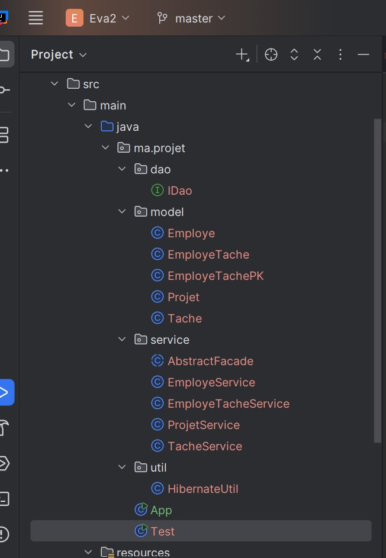
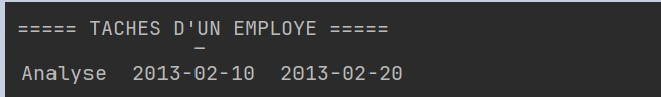
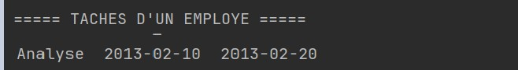
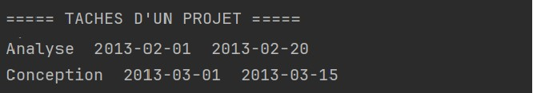
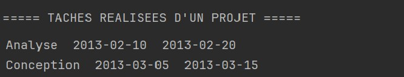
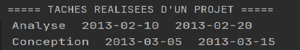

# Application de Gestion des Projets et des Tâches

## Description

Cette application Java permet de gérer des **employés**, des **projets** et des **tâches** en utilisant **JPA et Hibernate**.  
Elle permet d'affecter des tâches aux employés et de suivre leur réalisation avec les dates réelles.

---

## Technologies utilisées

- **Java**
- **JPA (Java Persistence API)**
- **Hibernate**
- **Base de données H2 (In-Memory)**
- **Maven**
- **IntelliJ IDEA**

---

## Structure du projet

---
## Fonctionnalités implémentées

L'application permet d'exécuter les opérations suivantes :

- Création des **employés**
- Création des **projets**
- Création des **tâches**
- Affectation des **tâches aux employés**
- Consultation des informations liées aux projets et aux tâches

---

## Méthodes implémentées

### 1. Afficher les tâches réalisées par un employé

Cette méthode permet d'afficher les tâches effectuées par un employé avec les dates réelles.

### Résultat d'exécution

---

### 2. Afficher les projets gérés par un employé

Cette méthode retourne la liste des projets dont l'employé est responsable.

### Résultat d'exécution

### 3. Afficher les tâches planifiées pour un projet

Cette méthode affiche toutes les tâches associées à un projet.

### Résultat d'exécution

---
### 4. Afficher les tâches réalisées pour un projet

Cette méthode affiche toutes les tâches associées à un projet.

### Résultat d'exécution

---

### 5. Afficher les tâches dont le prix est supérieur à 1000

Cette requête utilise une **NamedQuery** pour récupérer les tâches dont le prix dépasse 1000.

### Résultat d'exécution

---

### 6. Afficher les tâches réalisées entre deux dates

Cette méthode permet de filtrer les tâches réalisées dans un intervalle de dates donné.

### Résultat d'exécution

---
