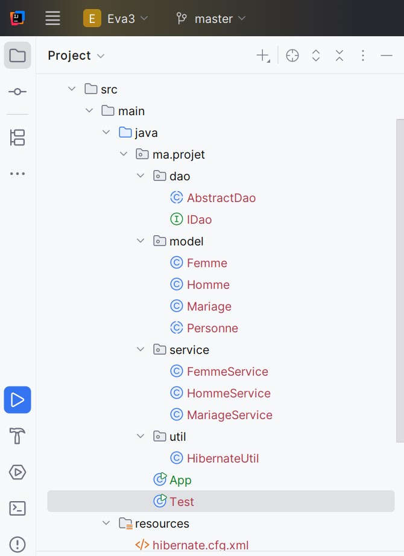
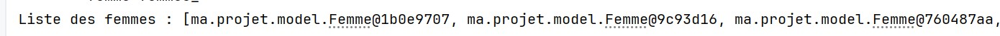
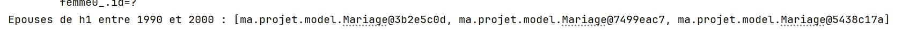
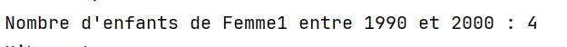
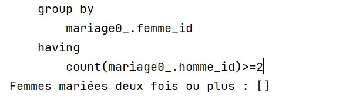
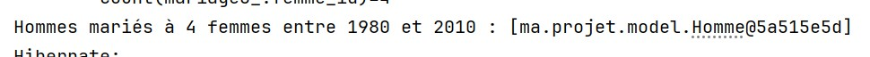
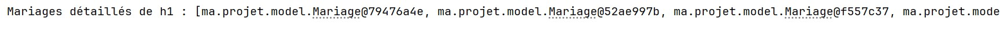

# Application de gestion de l’état civil

## Contexte
Cette application permet de gérer les citoyens et leurs relations matrimoniales dans une province.

## Objectifs
- Créer et gérer les hommes, femmes et mariages.
- Afficher les épouses d’un homme entre deux dates.
- Afficher le nombre d’enfants d’une femme entre deux dates.
- Identifier les femmes mariées deux fois ou plus.
- Identifier les hommes mariés à quatre femmes entre deux dates.
- Afficher les mariages d’un homme avec tous les détails.

## Technologies utilisées
- **Java**
- **JPA (Java Persistence API)**
- **Hibernate**
- **MySQL**
- **Maven**
- **IntelliJ IDEA**
---

## Exemple de sorties attendues
- Liste des femmes
- Femme la plus âgée
- Épouses d’un homme entre deux dates
- Nombre d’enfants d’une femme
- Femmes mariées deux fois ou plus
- Hommes mariés à 4 femmes
- Mariages détaillés d’un homme
---

## Structure de projet

## Screenshots
---
### Liste des femmes

### Femme la plus âgée

### Épouses d’un homme

## Nnombre d’enfants d’une femme entre deux dates.

## Femmes mariées deux fois ou plus.

## Hommes mariés à quatre femmes entre deux dates.

### Mariages détaillés

